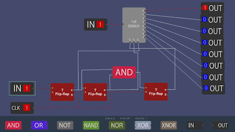

# LogicSim
A digital logic simulator made as a project for Object Oriented Programming (OOP) in C++.

## A very low quality screencap:

  

## Dependencies:

- [SDL](https://github.com/libsdl-org/SDL)
- [SDL_image](https://github.com/libsdl-org/SDL_image)

*At the moment, sequential circuits don't really work properly. Might fix it when I have time.*
